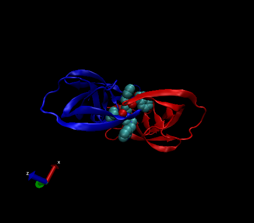

```{r}
db <- read.csv("Data Export Summary.csv", row.names=1)
head(db)
```

>Q1: What percentage of structures in the PDB are solved by X-Ray and Electron Microscopy.

```{r}
method.sums <- colSums(db)
round((method.sums/method.sums["Total"]) * 100, 2)
```

92.47%

>Q2: What proportion of structures in the PDB are protein?

```{r}
round((db$Total/method.sums["Total"]) * 100,2)

```
87.36%

>Q3: Type HIV in the PDB website search box on the home page and determine how many HIV-1 protease structures are in the current PDB?

1821 HIV-1 protease structures 

#import image from VDM



Just write test but have some **formatting**

#Using Bio3D

i need the library
```{r}
library(bio3d)

pdb <-read.pdb("1hsg")
pdb
```

```{r}
aa123(pdbseq(pdb))
```

plot of B-factor
```{r}
plot.bio3d(pdb$atom$b, sse = pdb)
```

the ATOM records

```{r}
head(pdb$atom)
```


>Q4: Water molecules normally have 3 atoms. Why do we see just one atom per water molecule in this structure?

>Q5: There is a conserved water molecule in the binding site. Can you identify this water molecule? What residue number does this water molecule have (see note below)?
